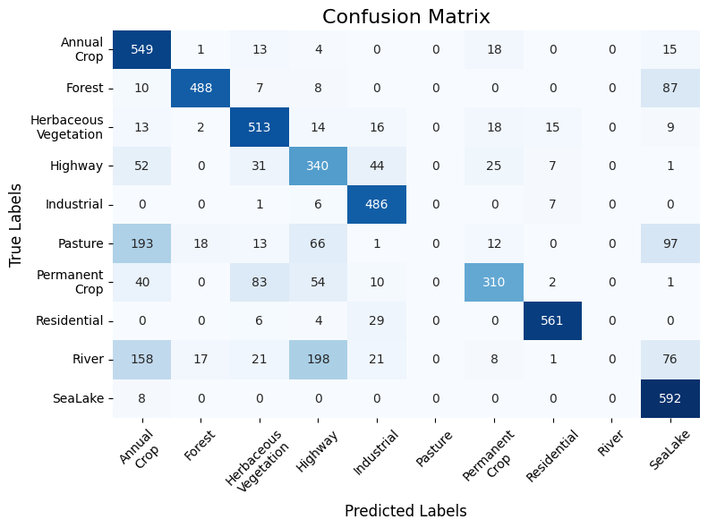

# Lab.py
Common code to plot metrics and evaluate pennylane-torch models.
- `Lab.py`
   - JSON file -> (n) `Experiment` -> `Trainer` -> `Plotter`.

# Plots

## HQNN-Parallel (10k Examples)

## HQNN-Parallel (Full Dataset)

## QEConv  (10k Examples)

